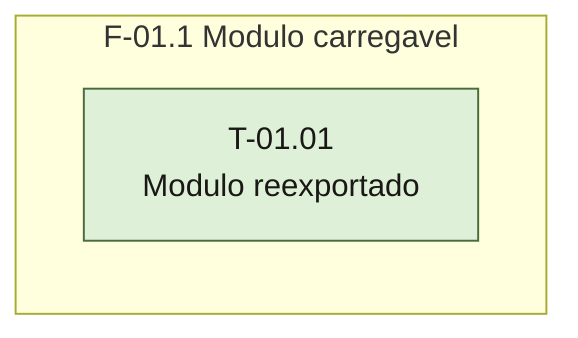

# Plano — Sprint 01 — Capacidade de testar o módulo proximo-numero

## Objetivo da sprint

Deixar o módulo `src/proximo-numero.js` existente, carregável pelo harness `node:test` e reexportado por `src/index.js` (D-04), sem regra de negócio — para que o TDD da sprint-02 tenha onde escrever o teste vermelho.

## Critério de saída da sprint

`npm test` termina com 0 falhas, incluindo `test/smoke.test.js` e os testes de carga de `test/proximo-numero.test.js`.

## Riscos conhecidos

- Sem versão mínima de Node declarada no `package.json` (`base/harness-de-teste.md`); D-13 registra o runtime local v24.18.0.

## Fora de escopo

- Regra de incremento e validação de entrada de `proximoNumero` — é a sprint-02.
- `proximoCodigo` — FT-02 (D-03).

## Fase F-01.1 — Módulo carregável e reexportado

**Objetivo:** módulo novo e ponto público de exportação prontos para teste.

**Tasks:** T-01.01

**Critério de saída:** `test/proximo-numero.test.js` carrega `src/proximo-numero.js` e `src/index.js` e os dois testes da T-01.01 passam.

**Roda em paralelo com:** nenhuma.

**Status da fase:** concluído em 2026-09-16.

## Portão da sprint — suíte inteira

Sprint concluída em 2026-09-16. Saída de `npm test`:

```
✔ T-01.01 integracao: src/index.js reexporta proximoNumero de src/proximo-numero.js (1.949ms)
✔ T-01.01 funcional: proximoNumero e funcao e o index continua objeto (0.1552ms)
✔ o modulo principal carrega (2.0234ms)
ℹ tests 3
ℹ pass 3
ℹ fail 0
```

### Grafo de tasks



## Tasks

---

```yaml
id: T-01.01
titulo: Modulo proximo-numero carregavel e reexportado pelo index
objetivo: Criar o modulo src/proximo-numero.js e seu arquivo de teste, expondo proximoNumero como propriedade nomeada de src/index.js
arquivos:
  cria: [src/proximo-numero.js, test/proximo-numero.test.js]
  altera: [src/index.js]
teste_integracao: require de src/index.js expoe proximoNumero como a mesma referencia exportada por src/proximo-numero.js
teste_funcional: Dado o require de src/proximo-numero.js, typeof proximoNumero e function e typeof do objeto de src/index.js continua object
criterio_aceite: npm test sai com codigo 0 e o arquivo test/proximo-numero.test.js tem os dois testes da T-01.01 passando
depende_de: []
paralelizavel: false
status: concluida
```

2026-09-16 · suíte: 3 passed, 0 failed (npm test, suíte inteira) · real: 0,1 h
