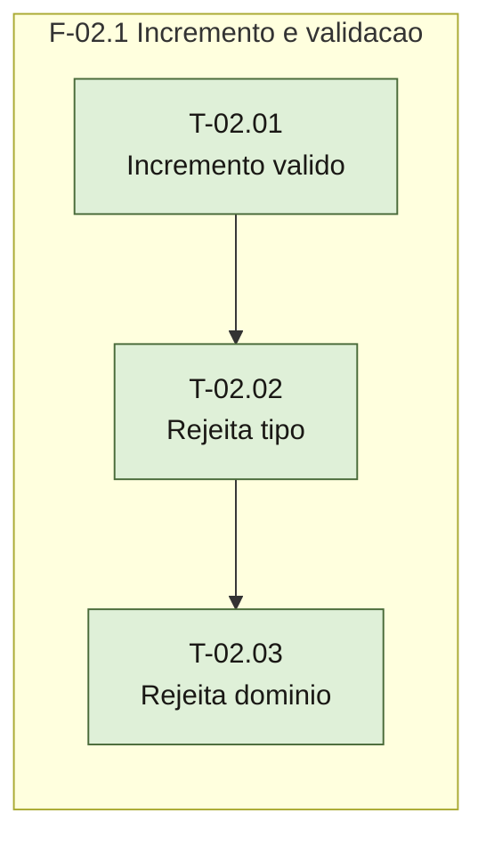

# Plano — Sprint 02 — Contrato de proximoNumero

## Objetivo da sprint

Implementar sob TDD o contrato de `proximoNumero(valor)`: devolve `valor + 1` para inteiro `number` `>= 0` e lança `TypeError` para toda outra entrada (D-06 a D-10).

## Critério de saída da sprint

`npm test` termina com 0 falhas (suíte inteira), com `proximoNumero(0)` devolvendo `1` e as oito entradas inválidas de D-07 (`-1`, `1.5`, `NaN`, `Infinity`, `-Infinity`, `1n`, `'1'`, `new Number(1)`) lançando `TypeError`.

## Riscos conhecidos

- Inteiro acima de `Number.MAX_SAFE_INTEGER` perde precisão em `valor + 1` (`docs/projeto/PREMISSAS.md` PR-06, D-09) — aceito, sem teto.

## Fora de escopo

- `proximoCodigo` e prefixo `SEQ-` — FT-02 (D-03).
- Texto da mensagem do `TypeError` — não é contrato (D-10).
- Coerção de string ou `BigInt` — descartada (D-06).

## Fase F-02.1 — Incremento e validação de entrada

**Objetivo:** caminho feliz e as duas famílias de rejeição, cada uma com teste vermelho antes.

**Tasks:** T-02.01, T-02.02, T-02.03

**Critério de saída:** as três tasks concluídas com seus pares de testes passando em `npm test`.

**Roda em paralelo com:** nenhuma.

**Status da fase:** concluído em 2026-09-16.

## Portão da sprint — suíte inteira

Sprint concluída em 2026-09-16. Saída de `npm test`:

```
✔ T-01.01 integracao: src/index.js reexporta proximoNumero de src/proximo-numero.js (4.1612ms)
✔ T-01.01 funcional: proximoNumero e funcao e o index continua objeto (0.2992ms)
✔ T-02.01 integracao: proximoNumero(0) pelo objeto exportado de src/index.js devolve 1 (0.2592ms)
✔ T-02.01 funcional: 41, -0 e MAX_SAFE_INTEGER devolvem 42, 1 e MAX_SAFE_INTEGER + 1 (0.2365ms)
✔ T-02.02 integracao: proximoNumero('1') pelo objeto exportado de src/index.js lanca TypeError (0.5858ms)
✔ T-02.02 funcional: 1n, '1' e new Number(1) lancam TypeError (2.8584ms)
✔ T-02.03 integracao: proximoNumero(-1) pelo objeto exportado de src/index.js lanca TypeError (0.5287ms)
✔ T-02.03 funcional: -1, 1.5, NaN, Infinity e -Infinity lancam TypeError (0.4124ms)
✔ o modulo principal carrega (5.1893ms)
ℹ tests 9
ℹ pass 9
ℹ fail 0
```

### Grafo de tasks



## Tasks

---

```yaml
id: T-02.01
titulo: Incremento de inteiro valido
objetivo: proximoNumero devolve valor + 1 para inteiro number maior ou igual a zero
arquivos:
  cria: []
  altera: [src/proximo-numero.js, test/proximo-numero.test.js]
teste_integracao: Chamando proximoNumero pelo objeto exportado de src/index.js com 0, o retorno e 1
teste_funcional: Dadas as entradas 41, -0 e Number.MAX_SAFE_INTEGER, os retornos sao 42, 1 e Number.MAX_SAFE_INTEGER + 1
criterio_aceite: Os dois testes da T-02.01 passam e o smoke continua passando em npm test
depende_de: [T-01.01]
paralelizavel: false
status: concluida
```

2026-09-16 · suíte: 5 passed, 0 failed (npm test, suíte inteira) · real: 0,1 h · teste funcional ganhou o caso 2 ** 53 após revisão de testes (fraco → sólido, D-09)

---

```yaml
id: T-02.02
titulo: Rejeicao de tipo diferente de number
objetivo: proximoNumero lanca TypeError sincrono quando typeof valor nao e number
arquivos:
  cria: []
  altera: [src/proximo-numero.js, test/proximo-numero.test.js]
teste_integracao: Chamando proximoNumero pelo objeto exportado de src/index.js com a string '1', a chamada lanca TypeError
teste_funcional: Dadas as entradas 1n, '1' e new Number(1), cada chamada lanca TypeError
criterio_aceite: Os dois testes da T-02.02 passam e os testes da T-02.01 continuam passando em npm test
depende_de: [T-02.01]
paralelizavel: false
status: concluida
```

2026-09-16 · suíte: 7 passed, 0 failed (npm test, suíte inteira) · real: 0,1 h · teste funcional ganhou undefined, null e true após revisão de testes (fraco → sólido, PR-05)

---

```yaml
id: T-02.03
titulo: Rejeicao de number fora do dominio
objetivo: proximoNumero lanca TypeError sincrono para number negativo, fracionario, NaN ou infinito
arquivos:
  cria: []
  altera: [src/proximo-numero.js, test/proximo-numero.test.js]
teste_integracao: Chamando proximoNumero pelo objeto exportado de src/index.js com -1, a chamada lanca TypeError
teste_funcional: Dadas as entradas -1, 1.5, NaN, Infinity e -Infinity, cada chamada lanca TypeError
criterio_aceite: Os dois testes da T-02.03 passam e os testes da T-02.01 e T-02.02 continuam passando em npm test
depende_de: [T-02.02]
paralelizavel: false
status: concluida
```

2026-09-16 · suíte: 9 passed, 0 failed (npm test, suíte inteira) · real: 0,1 h
